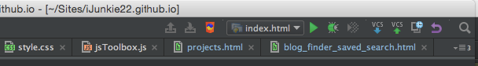

SiteHTML
=========

## Using in JetBrains WebStorm
In Preferences \> Tools \> External Tools

Click the + button to add a new item. Enter these settings:

Program: `/usr/bin/python`

Parameters: `-m SiteHTML "$ProjectFileDir$/"`

Working directory: **PATH TO SiteHTML**\*

You can then use the macro simply by selecting it in the Tools window menu.

If you want to use it in the toolbar, you can use the  icon.

\* This is only necessary if you do not use the python setup script